<!DOCTYPE html>
<html lang="en">
<meta charset="UTF-8"><body>

<h2 id="contents">Study17 README Contents</h2>
<h3 id="top">The assessment of the libraries</h3>
<table style="border:solid">
<tbody>
<tr>
<td style="border:solid">Java Mapping Framework <a href="https://mapstruct.org/">MapStruct</a></td>
<td style="border:solid"><a href="https://commons.apache.org/proper/commons-collections/">Apache Commons Collections</a></td>
</tr><tr>
<td style="border:solid"><a href="https://github.com/npgall/concurrent-trees">Concurrent Radix &amp; Suffix Trees</a></td>
<td style="border:solid"><a href="https://www.eclipse.org/collections/">Eclipse Collections</a></td>
</tr>
</tbody></table>

 

The sections of this project:

<ol>
<li><a href="#ONE">Docker Build</a></li>
<li><a href="#TWO">MapStruct</a></li>
<li><a href="#THREE">Commons Collections</a></li>
<li><a href="#FOUR">Concurrent Radix &amp; Suffix Trees</a></li>
<li><a href="#FIVE">Eclipse Collections</a></li>
</ol>

Java source code: 
 

	<a href="https://github.com/k1729p/Study17/blob/master/src/main/java/kp">kp</a> 

 

    <a href="http://htmlpreview.github.io/?https://github.com/k1729p/Study17/blob/main/docs/apidocs/index.html">
	Java API Documentation</a> 

<a href="#top">Back to the top of the page</a>

<h2 id="ONE">❶ Docker Build</h2>

Action: 
 
 1. With the batch file 
<a href="https://github.com/k1729p/Study17/blob/main/0_batch/01%20Docker%20build%20and%20run.bat">
<i>"01 Docker build and run.bat"</i></a> build the image and start the container 

with the application <a href="https://github.com/k1729p/Study17/blob/main/src/main/java/kp/ApplicationForLibrariesAssay.java">
'kp.ApplicationForLibrariesAssay'</a>. 
 2. With the batch file 
<a href="https://github.com/k1729p/Study17/blob/main/0_batch/02%20Docker%20show%20logs.bat">
<i>"02 Docker show logs.bat"</i></a> view the console logs from the application run. 

 
 

1.1. The Docker image is built using these files:
<a href="https://raw.githubusercontent.com/k1729p/Study17/main/docker-config/Dockerfile"><b>Dockerfile</b></a> and
<a href="https://raw.githubusercontent.com/k1729p/Study17/main/docker-config/compose.yaml"><b>compose.yaml</b></a>.

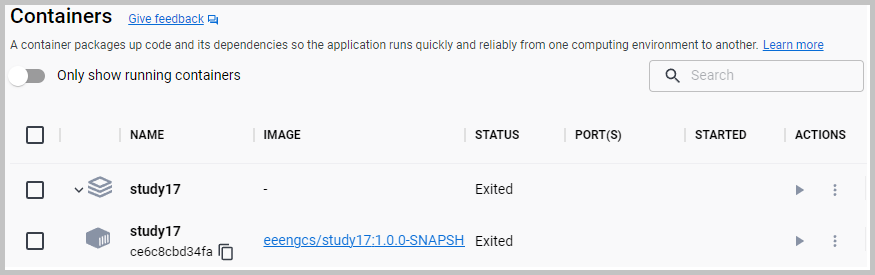 

<i>The screenshot of the created Docker containers.</i>

 

1.2. Alternative batch files. 
For building and running the 
<a href="https://github.com/k1729p/Study17/blob/main/src/main/java/kp/ApplicationForLibrariesAssay.java">
'kp.ApplicationForLibrariesAssay'</a> on 'localhost' use 
<a href="https://github.com/k1729p/Study17/blob/main/0_batch/03%20MVN%20clean%20install%20run.bat"> 
<i>"03 MVN clean install run.bat"</i></a>. 
For only running the 
<a href="https://github.com/k1729p/Study17/blob/main/src/main/java/kp/ApplicationForLibrariesAssay.java">
'kp.ApplicationForLibrariesAssay'</a> on 'localhost' use 
<a href="https://github.com/k1729p/Study17/blob/main/0_batch/04%20Run%20Application.bat"> 
<i>"04 Run Application.bat"</i></a>.

<a href="#top">Back to the top of the page</a>

<h2 id="TWO">❷ MapStruct</h2>

2.1. The mapping launch method: 
<a href="https://github.com/k1729p/Study17/blob/main/src/main/java/kp/mappers/MapperLauncher.java#L36">
'kp.mappers.MapperLauncher::launch'</a> 

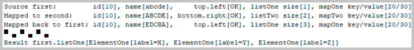 

<i>Console log from 'kp.mappers.MapperLauncher::launch' method.</i>

2.2. The mapping <b>source</b> objects:

<ul>
<li><a href="https://github.com/k1729p/Study17/blob/main/src/main/java/kp/mappers/samples/First.java">First</a></li>
<li><a href="https://github.com/k1729p/Study17/blob/main/src/main/java/kp/mappers/samples/builders/Top.java">Top</a></li>
<li><a href="https://github.com/k1729p/Study17/blob/main/src/main/java/kp/mappers/samples/items/ElementOne.java">ElementOne</a></li>
<li><a href="https://github.com/k1729p/Study17/blob/main/src/main/java/kp/mappers/samples/items/KeyOne.java">KeyOne</a></li>
<li><a href="https://github.com/k1729p/Study17/blob/main/src/main/java/kp/mappers/samples/items/ValueOne.java">ValueOne</a></li>
</ul>

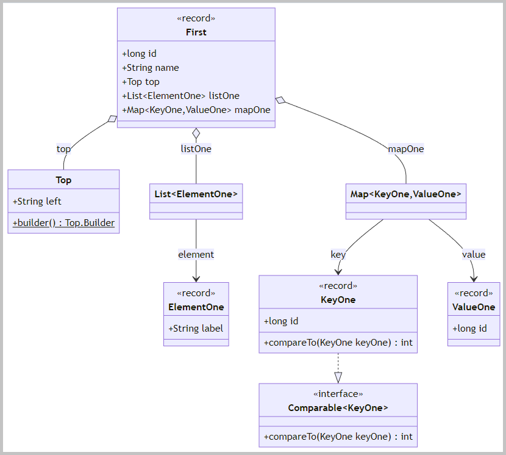 

<i>The class diagram of the mapping source objects.</i>

2.3. The mapping <b>target</b> objects:

<ul>
<li><a href="https://github.com/k1729p/Study17/blob/main/src/main/java/kp/mappers/samples/Second.java">Second</a></li>
<li><a href="https://github.com/k1729p/Study17/blob/main/src/main/java/kp/mappers/samples/builders/Bottom.java">Bottom</a></li>
<li><a href="https://github.com/k1729p/Study17/blob/main/src/main/java/kp/mappers/samples/items/ElementTwo.java">ElementTwo</a></li>
<li><a href="https://github.com/k1729p/Study17/blob/main/src/main/java/kp/mappers/samples/items/KeyTwo.java">KeyTwo</a></li>
<li><a href="https://github.com/k1729p/Study17/blob/main/src/main/java/kp/mappers/samples/items/ValueTwo.java">ValueTwo</a></li>
</ul>

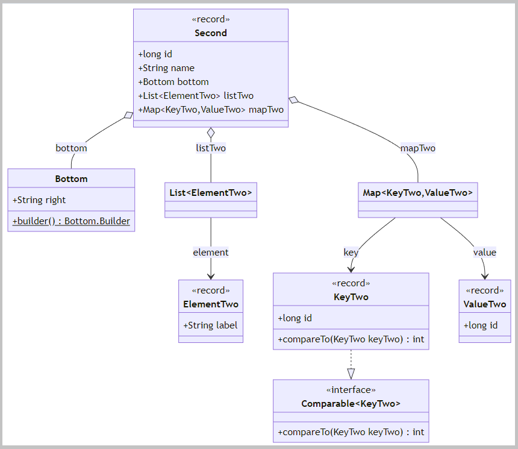 

<i>The class diagram of the mapping target objects.</i>

2.4. The interfaces are marked with the annotation '@Mapper':

<ul>
<li><a href="https://github.com/k1729p/Study17/blob/main/src/main/java/kp/mappers/FirstMapper.java">
'kp.mappers.FirstMapper'</a></li>
<li><a href="https://github.com/k1729p/Study17/blob/main/src/main/java/kp/mappers/FirstMapper.java#L99">
'kp.mappers.FirstMapper.ElementOneMapper'</a></li>
<li><a href="https://github.com/k1729p/Study17/blob/main/src/main/java/kp/mappers/FirstMapper.java#L121">
'kp.mappers.FirstMapper.KeyOneMapper'</a></li>
<li><a href="https://github.com/k1729p/Study17/blob/main/src/main/java/kp/mappers/FirstMapper.java#L144">
'kp.mappers.FirstMapper.ValueOneMapper'</a></li>
</ul>

This marking activates the generation of an implementation of that type via 'MapStruct'.

2.5. The mapping method: 
<a href="https://github.com/k1729p/Study17/blob/main/src/main/java/kp/mappers/FirstMapper.java#L38">
'kp.mappers.FirstMapper::toSecond'</a> 
The finishing method: 
<a href="https://github.com/k1729p/Study17/blob/main/src/main/java/kp/mappers/FirstMapper.java#L58">
'kp.mappers.FirstMapper::afterToSecond'</a>

2.6. The inverse mapping method: 
<a href="https://github.com/k1729p/Study17/blob/main/src/main/java/kp/mappers/FirstMapper.java#L49">
'kp.mappers.FirstMapper::fromSecond'</a> 
The finishing method: 
<a href="https://github.com/k1729p/Study17/blob/main/src/main/java/kp/mappers/FirstMapper.java#L69">
'kp.mappers.FirstMapper::afterFromSecond'</a>

<a href="#top">Back to the top of the page</a>

<h2 id="THREE">❸ Commons Collections</h2>

3.1. The method 
<a href="https://github.com/k1729p/Study17/blob/main/src/main/java/kp/collections/commons/ApacheCommonsCollections.java#L41">
'kp.collections.commons.ApacheCommonsCollections::researchBidirectionalMap'</a>.

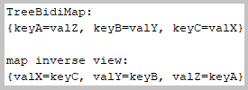 

<i>Console log from 'ApacheCommonsCollections::researchBidirectionalMap' method.</i>

3.2. The method 
<a href="https://github.com/k1729p/Study17/blob/main/src/main/java/kp/collections/commons/ApacheCommonsCollections.java#L60">
'kp.collections.commons.ApacheCommonsCollections::researchPatriciaTrie'</a>.

<b>PATRICIA</b>: Practical Algorithm to Retrieve Information Coded in Alphanumeric. 
A <i>trie</i> is also called a <i>digital tree</i>, <i>radix tree</i>, or <i>prefix tree</i>.

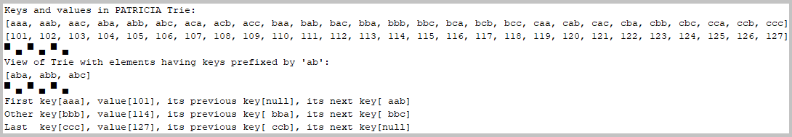 

<i>Console log from 'ApacheCommonsCollections::researchPatriciaTrie' method.</i>

<a href="#top">Back to the top of the page</a>

<h2 id="FOUR">❹ Concurrent Radix &amp; Suffix Trees</h2>

4.1. The method 
<a href="https://github.com/k1729p/Study17/blob/main/src/main/java/kp/trees/ConcurrentTrees.java#L60">
'kp.trees.ConcurrentTrees::researchRadixTree'</a>.

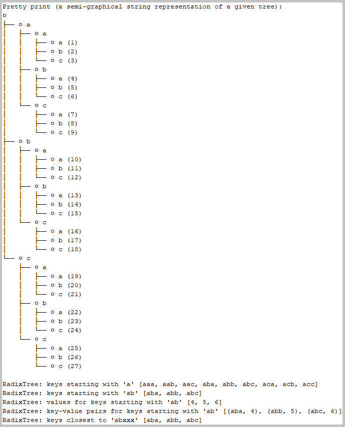 

<i>Console log from 'ConcurrentTrees::researchRadixTree' method.</i>

4.2. The method 
<a href="https://github.com/k1729p/Study17/blob/main/src/main/java/kp/trees/ConcurrentTrees.java#L92">
'kp.trees.ConcurrentTrees::researchSuffixTree'</a>.

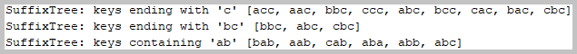 

<i>Console log from 'ConcurrentTrees::researchSuffixTree' method.</i>

4.3. The method 
<a href="https://github.com/k1729p/Study17/blob/main/src/main/java/kp/trees/ConcurrentTrees.java#L112">
'kp.trees.ConcurrentTrees::researchInvertedRadixTree'</a>.

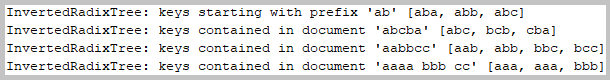 

<i>Console log from 'ConcurrentTrees::researchInvertedRadixTree' method.</i>

4.4. The method 
<a href="https://github.com/k1729p/Study17/blob/main/src/main/java/kp/trees/ConcurrentTrees.java#L140">
'kp.trees.ConcurrentTrees::researchReversedRadixTree'</a>.

 

<i>Console log from 'ConcurrentTrees::researchReversedRadixTree' method.</i>

4.5. The method 
<a href="https://github.com/k1729p/Study17/blob/main/src/main/java/kp/trees/ConcurrentTrees.java#L155">
'kp.trees.ConcurrentTrees::researchPrefixesAndSuffixesGenerator'</a>.

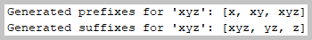 

<i>Console log from 'ConcurrentTrees::researchPrefixesAndSuffixesGenerator' method.</i>

4.6. The method 
<a href="https://github.com/k1729p/Study17/blob/main/src/main/java/kp/trees/ConcurrentTrees.java#L169">
'kp.trees.ConcurrentTrees::researchSolver'</a>.

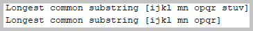 

<i>Console log from 'ConcurrentTrees::researchSolver' method.</i>

<a href="#top">Back to the top of the page</a>

<h2 id="FIVE">❺ Eclipse Collections</h2>

5.1. The method 
<a href="https://github.com/k1729p/Study17/blob/main/src/main/java/kp/collections/eclipse/EclipseCollections.java#L131">
'kp.collections.eclipse.EclipseCollections::researchChunksAndPairs'</a> 

The chunk - a collection of a specified fixed size.

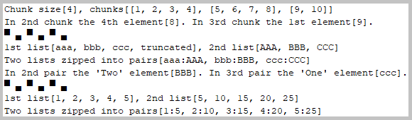 

<i>Console log from 'EclipseCollections::researchChunksAndPairs' method.</i>

5.2. The method 
<a href="https://github.com/k1729p/Study17/blob/main/src/main/java/kp/collections/eclipse/EclipseCollections.java#L174">
'kp.collections.eclipse.EclipseCollections::researchMapFlipping'</a> 

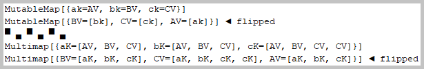 

<i>Console log from 'EclipseCollections::researchMapFlipping' method.</i>

5.3. The method 
<a href="https://github.com/k1729p/Study17/blob/main/src/main/java/kp/collections/eclipse/EclipseCollections.java#L214">
'kp.collections.eclipse.EclipseCollections::researchSetOperations'</a> 

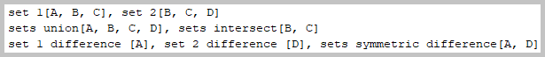 

<i>Console log from 'EclipseCollections::researchSetOperations' method.</i>

5.4. The method 
<a href="https://github.com/k1729p/Study17/blob/main/src/main/java/kp/collections/eclipse/EclipseCollections.java#L242">
'kp.collections.eclipse.EclipseCollections::researchUsingDates'</a> 

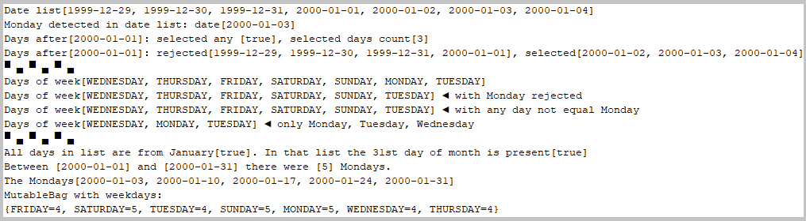 

<i>Console log from 'EclipseCollections::researchUsingDates' method.</i>

5.5. The method 
<a href="https://github.com/k1729p/Study17/blob/main/src/main/java/kp/collections/eclipse/EclipseCollections.java#L326">
'kp.collections.eclipse.EclipseCollections::researchUsingNumbers'</a> 

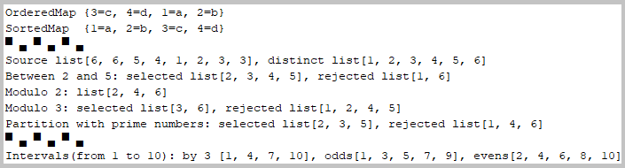 

<i>Console log from 'EclipseCollections::researchUsingNumbers' method.</i>

5.6. The method 
<a href="https://github.com/k1729p/Study17/blob/main/src/main/java/kp/collections/eclipse/EclipseCollections.java#L383">
'kp.collections.eclipse.EclipseCollections::researchStacks'</a> 

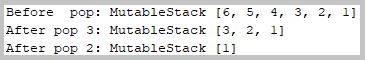 

<i>Console log from 'EclipseCollections::researchStacks' method.</i>

<a href="#top">Back to the top of the page</a>

</body>
</html>