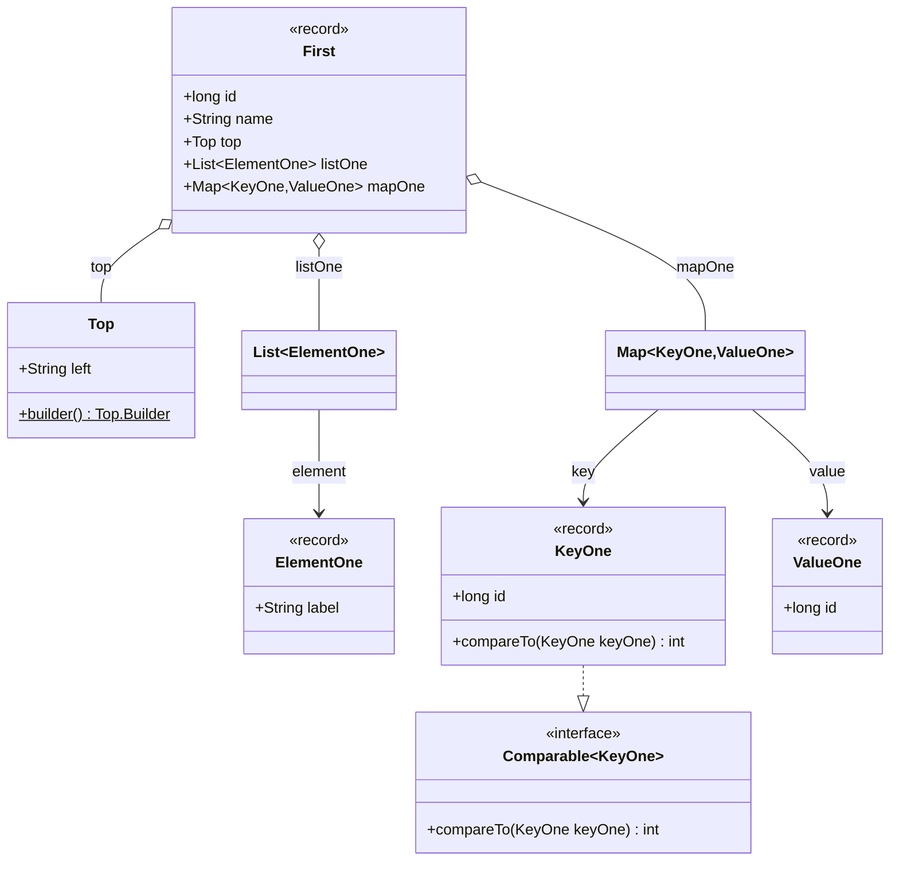
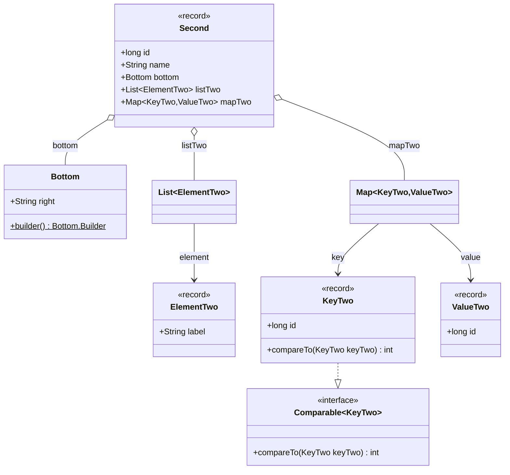

```mermaid
classDiagram
direction TD
class First {
 <<record>>
 +long id
 +String name
 +Top top
 +List~ElementOne~ listOne
 +Map~KeyOne,ValueOne~ mapOne
}
class Top {
 +String left
 +builder()$ Top.Builder
}
class ElementOne {
 <<record>>
 +String label
}
class KeyOne {
 <<record>>
 +long id
 +compareTo(KeyOne keyOne) int
}
class ValueOne {
 <<record>>
 +long id
}
class Comparable~KeyOne~ {
 <<interface>>
 +compareTo(KeyOne keyOne) int
}

First o-- Top : top
First o-- List~ElementOne~ : listOne
First o-- Map~KeyOne,ValueOne~ : mapOne
List~ElementOne~ --> ElementOne : element
KeyOne ..|> Comparable~KeyOne~
Map~KeyOne,ValueOne~ --> KeyOne : key
Map~KeyOne,ValueOne~ --> ValueOne : value
```

```mermaid
classDiagram
direction TD
class Second {
 <<record>>
 +long id
 +String name
 +Bottom bottom
 +List~ElementTwo~ listTwo
 +Map~KeyTwo,ValueTwo~ mapTwo
}
class Bottom {
 +String right
 +builder()$ Bottom.Builder
}
class ElementTwo {
 <<record>>
 +String label
}
class KeyTwo {
 <<record>>
 +long id
 +compareTo(KeyTwo keyTwo) int
}
class ValueTwo {
 <<record>>
 +long id
}
class Comparable~KeyTwo~ {
 <<interface>>
 +compareTo(KeyTwo keyTwo) int
}

Second o-- Bottom : bottom
Second o-- List~ElementTwo~ : listTwo
Second o-- Map~KeyTwo,ValueTwo~ : mapTwo
List~ElementTwo~ --> ElementTwo : element
KeyTwo ..|> Comparable~KeyTwo~
Map~KeyTwo,ValueTwo~ --> KeyTwo : key
Map~KeyTwo,ValueTwo~ --> ValueTwo : value
```